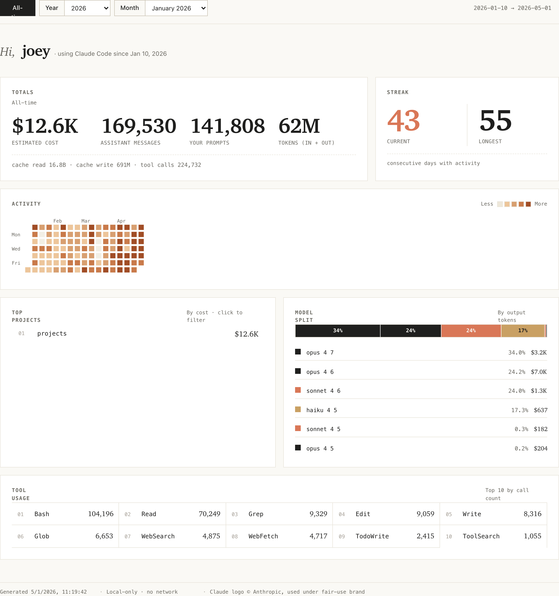

# MyClaude

A local, in-browser dashboard that turns your Claude Code conversation history into GitHub-style usage stats — no server, no account, no upload.

Live: **[stats.howtoai.sh](https://stats.howtoai.sh)**



---

## What it is

MyClaude reads `~/.claude/projects` (the JSONL transcripts Claude Code writes locally) and renders a filterable dashboard: contribution heatmap, totals, top projects, model split, streak, top tools. Everything runs inside the browser tab — the page makes zero outbound network requests with your data.

Inspired by [chandr3w/tikivc/mymonthwithclaude](https://github.com/chandr3w/tikivc/tree/main/mymonthwithclaude), generalized beyond a single month with All-time / Year / Month filters and a GitHub-stats card lineup.

## How to run

**Requirements:**
- A Chromium-based browser (Chrome, Edge, Arc, Brave) — required for the File System Access API
- Python 3 (for the local dev server)

```bash
git clone https://github.com/joeyhipolito/myclaude.git
cd myclaude
make serve
```

`make serve` starts `python3 -m http.server 8000` inside `web/` and opens `http://localhost:8000` in your default browser. Ctrl-C to stop.

### Other commands

| Command | What it does |
|---|---|
| `make serve` | Start local dev server + open browser |
| `make tidy` | Run lint checks on JS/HTML sources |
| `make package` | Zip `web/` into `output/` for static hosting |

## Browser requirements

The File System Access API is required to read files from your local disk without uploading them. This API is only available in **Chromium-based browsers** (Chrome 86+, Edge 86+, Arc, Brave).

Firefox and Safari do not support `window.showDirectoryPicker()` as of mid-2026. The app shows a warning if opened in an unsupported browser.

## How the aggregator works

1. You click **Choose ~/.claude/projects** and select that folder.
2. The browser calls `showDirectoryPicker()` — you grant read-only access.
3. The aggregator walks the directory tree, finds all `.jsonl` files, and parses them line-by-line in memory.
4. Parsed records are bucketed by day / month / year / project / model / tool, then handed to the dashboard renderer.
5. No data leaves the browser tab at any point.

## Privacy

**Everything stays in your browser.** MyClaude has no backend, no analytics, no telemetry, and makes zero outbound network requests with your data after the page loads. You can verify this by opening DevTools → Network tab — it will only show static asset requests.
